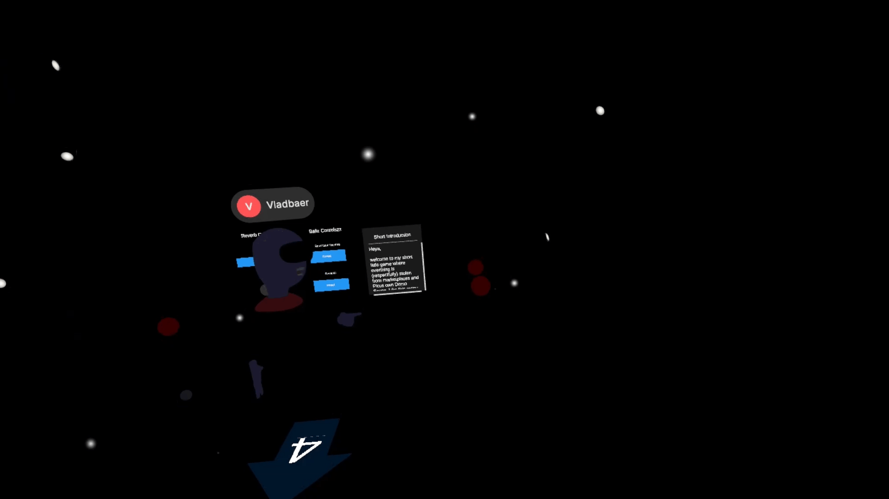

# VR Playground

This project was developed as part of a student project at the HfM (Trossingen), featuring a musical and interactive virtual world where players can collaborate, interact with objects, and react to their environment. Its starting ground was a Multiplayer Template by Maximilian Flack and Noam Hartmann. 

Developed by Valentin Händler and supervised by Prof. Norbert Schnell  

---

## Disclaimer

- **Asset-Use:** This Project uses Free Assets made by Dexsoft ("Free Furniture Pack"), the Unity XR Assets and the "FMOD for Unity" Asset. Because this project is made without the intent of earning money and its budget was zero dollars, its use case can be interpreted as "free-use". Please keep that in mind, when downloading this repository. Music and Sound was made by Valentin Händler. When its content is being further puplished a confirmation is requested. 
- **Development-Status:** The project is provided "as-is." No guarantee is given regarding compatibility with all VR headsets. Check the release Tab for further compatibility information

---

## Features

 

- 🎮 **XR Interaction Toolkit 3.x:** Vollständig integriertes Interaktionssystem für VR-Controller.
- 🖐️ **Hand Tracking & Gesture Support:** Unterstützung für direkte Handinteraktionen.
- 🖥️ **XR Device Simulator:** Teste und debugge VR-Interaktionen direkt im Unity Editor ohne Headset.
- 🎨 **Universal Render Pipeline (URP):** Optimierte Performance und Grafik für Standalone-VR (z. B. Meta Quest, Pico).
- ⚙️ **Modulares Ball- & Objekt-Management:** Physikalisch basierte Interaktions-Mechaniken.

---

## 🚀 How to / Erste Schritte

### Voraussetzungen

Stelle sicher, dass du folgende Tools installiert hast:

* **Unity Editor:** Version `2022.3 LTS` (oder neuer)
* **Unity Modules:** Android Build Support (für Quest/Pico Standalone)
* **Git** (optional für Cloning)

### Installation & Setup

1. **Repository klonen:**
   ```bash
   git clone https://github.com/DEIN_BENUTZERNAME/DEIN_REPOSITORY.git
   ```
2. **Projekt in Unity Hub öffnen:**
   - Öffne den **Unity Hub**.
   - Klicke auf **Add** -> **Add project from disk**.
   - Wähle den geklonten Projektordner aus und öffne ihn mit der passenden Unity-Version.
3. **Szene starten:**
   - Navigiere im Project-Fenster zu `Assets/Scenes/`.
   - Öffne die Hauptszene (z. B. `MainScene.unity`).
   - Drücke auf **Play** im Unity Editor, um den **XR Device Simulator** zu starten.

---

## 🛠️ How to Develop Further

Möchtest du das Projekt erweitern oder eigene Features hinzufügen? Hier ist die Struktur zur Orientierung:

### Projektstruktur

```text
Assets/
 ├── Scripts/          # Eigene C#-Skripte (z. B. BallManager.cs)
 ├── Prefabs/          # Wiederverwendbare Objekte & Interaktions-Prefabs
 ├── Materials/        # URP-Materialien und Shader
 ├── Scenes/           # Haupt- und Test-Szenen
 └── Samples/          # XR Interaction Toolkit Beispiele & Simulator
```

### Eigene Interaktionen hinzufügen

1. **Neue Objekte greifbar machen:**
   - Füge einem 3D-Modell eine `Rigidbody`- und `Collider`-Komponente hinzu.
   - Füge die Komponente `XR Grab Interactable` hinzu.
2. **Eigene Logik schreiben:**
   - Nutze die XR-Events (`On Select Entered`, `On Activate`), um eigene C#-Skripte bei Interaktion auszulösen.
3. **XR Device Simulator nutzen:**
   - Nutze die Tasten `W/A/S/D` und die Maus im Play Mode, um die VR-Hände ohne Headset zu steuern.


---

## 📜 Lizenz

Dieses Projekt ist unter der **MIT-Lizenz** veröffentlicht – siehe die [LICENSE](LICENSE)-Datei für Details.